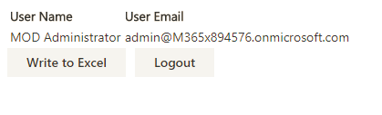
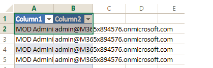

# Microsoft Graph Excel Starter Sample for React

## Table of contents

* [Introduction](#introduction)
* [Prerequisites](#prerequisites)
* [Register the application](#register-the-application)
* [Build and run the sample](#build-and-run-the-sample)
* [Questions and comments](#questions-and-comments)
* [Contributing](#contributing)
* [Additional resources](#additional-resources)

## Introduction

This sample shows how to connect an Angular 4.0 app to a Microsoft work or school (Azure Active Directory) using the [Microsoft Graph API](https://developer.microsoft.com/en-us/graph/) with the [Microsoft Graph JavaScript SDK](https://github.com/microsoftgraph/msgraph-sdk-javascript) to get information about the signed-in user and upload that information to an Excel file stored in OneDrive.

Once you authenticate and authorize the application, it gets the signed-in user's name and email address.

When you click the **Write to Excel** button, the application writes the user information to an Excel file stored in the user's root OneDrive folder.

## Prerequisites

To use this sample, you need the following:
* [Node.js](https://nodejs.org/). Node is required to run the sample on a development server and to install dependencies. 
* Either a [Microsoft account](https://www.outlook.com) or [Office 365 for business account](https://msdn.microsoft.com/en-us/office/office365/howto/setup-development-environment#bk_Office365Account)
* Upload the **demo.xlsx** file in the root of this repository to the root folder of your OneDrive account. This file contains an empty table with two columns.

## Register the application

1. Sign into [Azure Portal - App Registrations](https://go.microsoft.com/fwlink/?linkid=2083908) using either your personal or work or school account.

2. Choose **New registration**.

3. In the **Name** section, enter a meaningful application name that will be displayed to users of the app

1. In the **Supported account types** section, select **Accounts in any organizational directory and personal Microsoft accounts (e.g. Skype, Xbox, Outlook.com)**  

1. Select **Register** to create the application. 
	
   The application's Overview page shows the properties of your app.

4. Copy the **Application (client) Id**. This is the unique identifier for your app. 

5. In the list of pages for the app, select  **Authentication**.

6. In the **Redirect URIs** section, choose **Web** from the **Type** dropdown and enter *http://localhost:3000/* as the **Redirect URI**. 

1. Under **Advanced Settings** enable the implicit grant flow by checking the **Access tokens** and **ID tokens** boxes 

8. Choose **Save**.

## Build and run the sample

1. Using your favorite IDE, open **configs.ts** in *src/*.

2. Replace the **ENTER_YOUR_CLIENT_ID** placeholder value with the application ID of your registered Azure application.

3. In a command prompt, run the following command in the root directory: `npm install`.
  
4. Run `npm start` to start the development server.

5. Navigate to [http://localhost:3000/](http://localhost:3000/) in your web browser.

6. Choose the **Sign in with your Microsoft account** button.

7. Sign in with your personal or work or school account and grant the requested permissions.

8. Click the **Write to Excel** button. Verify that the rows have been added to the **demo.xslx** file that you uploaded to your root OneDrive folder.

## Contributing

If you'd like to contribute to this sample, see [CONTRIBUTING.MD](/CONTRIBUTING.md).

This project has adopted the [Microsoft Open Source Code of Conduct](https://opensource.microsoft.com/codeofconduct/). For more information see the [Code of Conduct FAQ](https://opensource.microsoft.com/codeofconduct/faq/) or contact [opencode@microsoft.com](mailto:opencode@microsoft.com) with any additional questions or comments.

## Questions and comments

We'd love to get your feedback about this sample. You can send your questions and suggestions in the [Issues](https://github.com/microsoftgraph/react-excelstarter-sample/issues) section of this repository.

Questions about Microsoft Graph development in general should be posted to [Stack Overflow](https://stackoverflow.com/questions/tagged/microsoftgraph). Make sure that your questions or comments are tagged with [microsoftgraph].
  
## Additional resources

- [Other Microsoft Graph Connect samples](https://github.com/MicrosoftGraph?utf8=%E2%9C%93&query=-Connect)
- [Microsoft Graph](https://developer.microsoft.com/en-us/graph/)

## Copyright
Copyright (c) 2017 Microsoft. All rights reserved.
